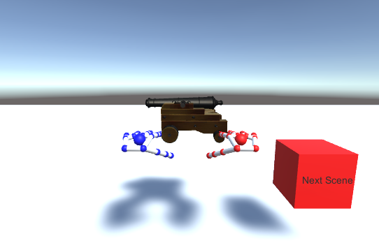

---
title: "NUI Alhambra"
author: "Francisco Javier Sáez Maldonado"
header-includes:
  -  \usepackage[utf8]{inputenc}
  -  \usepackage[T1]{fontenc}
  -  \usepackage[sfdefault,scaled=.85, lining]{FiraSans}
  -  \usepackage{geometry}
  -  \geometry{left=3cm,right=3cm,top=3cm,bottom=3cm,headheight=1cm,headsep=0.5cm}
  -  \usepackage{graphicx}

output:
    pdf_document
---


# Introducción

El Patronato de La Alhambra ha pedido que se realice un cambio radical de su concepto visual, sin poner limitaciones en cuanto a lo creativo y a lo económico. Por ello, trataremos de diseñar un NUI para el monumento de nuestra ciudad.

Se expondrán en este documento las ideas principales sobre nuestro proyecto, y más adelante se irán comentando las decisiones finales sobre el camino que tomará el mismo.

# Idea inicial

## Interacción usando Android

La idea inicial que propongo pretende dar una visión de la visita al monumento que sea totalmente renovada pero que trate a la vez de no perder la esencia de visitar un lugar histórico antiguo.

Se utilizará como dispositivo unas gafas que tendrán los cristales oscuros pero permitirán la visión normal del usuario. A partir de estas gafas, se podrán tendrán diferentes funcionalidades que permitirán una visita moderna e interactiva a la Alhambra. Las gafas tendrán incorporadas (en una versión de tamaño muy reducido para mantener la estética) los siguientes dispositivos:

- Cámara de fotos y vídeo
- Micrófono
- Acelerómetro y giroscopio
- GPS

El usuario deberá llevar las gafas puestas durante el recorrido y podrá ir caminando libremente por los jardines y palacios de la Alhambra. Mientras va caminando, las gafas irán detectando mediante reconocimiento de imágenes qué zonas son las que el individuo va observando, y si es una zona conocida o emblemática, un pequeño cuadro emergent$e^{(1)}$ aparecerí$a^{(2)}$ en el campo visual del usuario, como una etiqueta que le indica qué está viendo. En ese momento, el asistente de voz indicaría al usuario lo que está viendo y le preguntaría si desea obtener más información sobre el sitio. El usuario podrá dar una respuesta de diversas maneras como afirmando por su voz con un "Sí" o "No"", o haciendo un gesto de afirmación o negación con su cabeza que el dispositivo detectará.

Nuestro dispositivo tendrá ciertos recorridos programados para distintos tipos de usuarios que pudieran pedir tener una visita más monótona, pero el uso más común sería el que acabamos de comentar. Además, el GPS de las gafas se encargaría de detectar la posición del usuario y el dispositivo podría indicarle por el asistente de voz al mismo que está cerca de ciertos monumentos y ofrecería si quiere indicarle el camino hacia los mismos. Si el usuario se niega a esto, el asistente ofrecería los nombres de algunos de los sitios algo más lejanos por si el usuario le apetece visitar algún otro lugar.

Dado que estás visitando un monumento cultural de gran importancia y con gran belleza estética, se me ocurre que se podría tener un botón en las gafas que haga una foto de lo que esté en el campo visual justamente en el momento en el que se pulsa el botón. Todas las fotos realizadas se podrían enviar tanto durante la visita como al final de la visita a un correo electrónico o a su mismo móvil utilizando el Bluetooth de forma instantánea.

Por último, el usuario tendría la posiblidad de pasar a un **modo retro** durante la visita. Este modo ofrecería una visión de la alhambra de la época, que podría ser o bien por ambos ojos, o bien por uno de ellos y el otro una vista normal para poder hacer una comparación de ambos mundos. En el modo retro, junto a los diferentes lugares aparecerían personajes de la época que narrarían información sobre el uso y otros datos del sitio en la época en la que la Alhambra era aún una pequeña ciudad.

**Aclaraciones**:
1. Este cuadro aparecería en la visión del usuario como un "bocadillo" de un cómic, y no entorpecería al usuario las vistas del lugar
2. Varios cuadros podrían convivir en la visión del usuario, si está por ejemplo en una zona ancha donde está divisando varios lugares importantes.

## Interacción Gestual

Se pretende ahora dar a nuestro *NUI* un nuevo tipo de interacción con el usuario que sea mediante gestos. Así que trataremos implementar algunas funcionalidades relacionadas con el ámbito. Tenemos 3 posibles dispositivos, entre los cuales **Leap Motion** llamó mi atención, pues lo había visto antes funcionando y tenía curiosidad por cómo sería trabajar con él.

Para poder utilizar esta parte de nuestro proyecto, se debería habilitar alguna sala en el recinto de la *Alhambra* donde se pudiesen encontrar tanto dispositivos *Leap Motion* como pantallas para poder usarlos.

Así, mi propuesta fue utilizar *Leap Motion* y, utilizando como complemento **Unity** encargándose este de la parte gráfica, realizar actividades gestuales que simulasen actividades que fueran similares a las que se podían hacer en la Alhambra cuando esta servía aún de ciudad. La idea sería utilizar *Leap Motion* en versión de escritorio, pues aunque era interesante utilizar la versión *Orion* (en la que pones el dispositivo a la altura de tu cabeza para detectar las manos en su posición natural), no disponíamos de ningún dispositivo de soporte para *Leap*. En concreto, propuse:

1. Un minijuego de crear figuras a partir de cubos, de manera que pudieses construir ciertos elementos emblemáticos de la alhambra como leones, torres o murallas y *unity* se encargase de construir una figura 3D cuando los elementos colocados fueran los correctos. 

2. Un minijuego en el que tenemos de frente una muralla de la Alhambra con agujeros en los que aparecerían personajes a los que tenemos que golpear con las manos para derribar.

Sin embargo, finalmente estas ideas no parecieron las mejores debido a que había partes de ellas que parecían conllevar cierta dificultad en algunos aspectos, ya que nunca habíamos trabajado ni con *unity* ni con *leap motion*. 

- El minijuego de construcción no parecía conllevar ninguna dificultad de implementación más allá de la que viene pre-definida en *leap motion*

- El minijuego de golpeo podría ocasionar problemas debido a que el rango que *leap* tiene para capturar las manos es bastante limitado y eso no nos permitiría realizar del todo correctamente la interacción que deseamos con el programa, pues al avanzar la mano hacia adelante para golpear, podríamos sacar las manos del rango y eso podría dar al usuario una experiencia no del todo satisfactoria.


## Interacción por voz

Como última parte de nuestro trabajo, realizaremos un asistente por voz que nos ayude a añadir algunas funcionalidades a nuestro *NUI*. Utilizaremos *VoiceXML* para ello. El espectro de posibilidades, al igual que en los casos anteriores, es amplio. 

Este agente podría ser incorporado fácilmente a nuestr dispositivo inicial (las gafas), pues incorporar un mini altavoz o entrada para auriculares y un micrófono , como ya se comentó en la idea inicial, no es costoso y encaja en el prototipo de dispositivo.

El agente debe ser capaz de mantener una conversación con un alto grado de naturalidad y debe ofrecer al usuario información útil sobre alguno de los aspectos que se pueden dar en una visita a la *Alhambra*.

Para que tuviese relación con las partes anteriores de nuestro trabajo, propuse que se hiciese un sistema que se encargase de proporcionar información sobre varios aspectos de un lugar emblemático individualmente. Por ejemplo, se podría pedir información sobre:

- Año de construcción
- Motivo de la construcción
- Estilo arquitectónico
- Uso actual del lugar

Para ello, el usuario puede preguntar de diferentes maneras al agente sobre estos temas y el agente daría una respuesta inmediata, pudiendo ser interrumpido por el usuario si este no desease más información sobre lo que ha preguntado.

En muchas ocasiones, el ruido puede ser un factor determinante en este tipo de sutuaciones, por lo que el agente debería tener una cierta seguridad de si lo que ha escuchado es correcto para ofrecer directamente la información al usuario. En caso de que la seguridad no fuese alta, el agente se encargaría de hacer una frase o pregunta de confirmación sobre lo que se ha requerido por parte del usuario.

\newpage 

# Implementación final

## Interacción usando Android 

### Planteamiento conjunto

Uno de mis compañeros había pensado algo similar a la primera idea que propuse, por lo que no fue difícil escoger esta idea y tratar de realizar una mezcla entre las ideas que ambos habíamos aportado. Quedamos de acuerdo en que nuestro dispositivo de trabajo serían unas gafas con dispositivos internos que nos permitan realizar diferentes tipos de interacciones con el usuario. 

En concreto, nuestra principal función sería la de reconocimiento de los diferentes lugares que se encuentran en la Alhambra y ofrecimiento al usuario de información de los mismos de cara a conocer la alhambra de forma más profunda sin quedarse solo en lo espectacular de la vista. 

Ahora, para realizar esto, disponemos de nuestro teléfono móvil como dispositivo. Es por ello, que decidimos que al abrir la aplicación, el teléfono estuviera directamente en modo cámara , simulando así la vista de una persona que va andando por la Alhambra. Entonces, cuando nuestra aplicación reconociese una cierta imagen previamente fijada por nosotros (pues hacer el sistema de reconocimiento completo sería bastante más complejo), mostrara una notificación que nos preguntase si queremos obtener información sobre el lugar hacia el que se está mirando. En caso afirmativo, en un lado de nuestro movil (simulando que en las gafas intentaríamos que no ocupase toda la visión, para que el usuario pudiese seguir viendo el monumento a la vez que leyendo o recibiendo la información.

Además, tratamos de plantear la aplicación de forma que fuera lo más ligera de menús de selección posible. Es por ello que todos los procesos trataremos que estén andando al mismo tiempo y ofrezcan una buena experiencia al usuario. El siguiente proceso importante es el uso del GPS para , sin dar al usuario una guía concreta de qué camino seguir al visitar la Alhambra y dándole libertad en este aspecto, detectar la posición del mismo y descubrirle ciertos lugares que estén cerca de él y pueda visitarlos. Para ello, cuando nuestra aplicación detecte la cercanía del usuario a uno de los monumentos, una notificación aparecería al usuario indicando que está cerca de uno y preguntándole si quiere obtener alguna indicación sobre cómo llegar al mismo. Hay que tener en cuenta que si un usuario acepta o rechaza información sobre un monumento, se debe introducir este en una lista de "monumentos visitados" y "monumentos que no se desean visitar por el momento", para que la aplicación descarte este tipo de monumentos si se vuelve a pasar cerca de ellos.

Por último, pensamos que hoy día es importante también llevar recuerdos en forma de fotografías de los sitios a donde vayas. Es por ello que incorporamos una funcionalidad para que la aplicación pueda acceder a la galería y compartir fotos de diversas maneras, entre ellas, utilizando el Bluetooth del teléfono.

Se pusieron sobre la mesa por mi parte otras ideas como la de realizar las aceptaciones o negaciones de información haciendo gestos con la cabeza que el acelerómetro de las gafas pudiese detectar. Sin embargo, se acabó rechazando la propuesta ya que es algo que puede parecer antinatural en una visita a este monumento. El modo retro propuesto se discutió como una buena idea,aunque finalmente se optó por implementar otras funcionalidades porque esto requería de implementar primero el reconocimiento de imágenes, cosas que, como comentaré más adelante, no salió bien.

### Implementación

La implementación final ha tratado de ajustarse a nuestros conocimientos en el tiempo dado. Es por ello que muchas de las funciones han tenido que verse reducidas en su implementación, tratando de ir a una aplicación útil y con un diseño lo más simple posible. Podemos resumir que la implementación final ha quedado en los siguientes puntos:

- El reconocimiento de imágenes es complejo de implementar. Aunque hicimos varios intentos de esto, requería mucho tiempo al no estar familiarizados con Android Studio, la instalación de OpenCV en el mismo, y a continuación el reconocimiento de imágenes. Es por ello que decidimos implementar un *lector de códigos QR*, donde la intención que se tiene es enunciar que la aplicación real estaría reconociendo imágenes en tiempo real (como es capaz de hacer *google Lens*), e identificando estas con los monumentos de la Alhambra.

- Dado que no disponemos de unas gafas que puedan realizar este tipo de acciones, suponemos para la implementación que nuestra pantalla táctil es un sensor táctil que tendrían las gafas en una de las patillas, y haremos ciertas acciones en nuestra pantalla táctil, como tocar para entrar en el menú, o deslizar con dos dedos a izquierda o derecha para aceptar o rechazar una petición por parte de la aplicación. 

- En la aplicación, se mostrarían la información dentro de las mismas gafas, sin embargo, lo que nosotros hemos hecho ha sido enlazar directamente códigos QR propios con páginas web de los monumentos, lo que provoca que al leer uno y realizar el gesto multitáctil, se abra el navegador y obtengamos la información desde la página web.

En cuanto al **diseño**, se ha tratado que la aplicación sea lo más simple posible, teniendo en ella los mínimos elementos que caracterizan a una aplicación corriente y tratando de que el diseño minimalista proporcione una buena sensación al usuario tanto estéticamente como en funcionalidad.

## Interacción gestual

Tras un largo proceso de debate, se decidió que mediante el uso de *Leap Motion* se podía realizar una simulación de prueba de ciertas **armas** de la época. Se habló de simular una catapulta mediante las manos. Finalmente, se optó por realizar un cañón. Usamos *Unity* para realizar la parte gráfica de la aplicación.



Se decidió que la aplicación contara con dos funcionalidades principales:

- Una funcionalidad de disparo mediante el cañón. Para ello, se utilizarían las dos manos de la siguiente forma: la mano izquierda apuntaría en una dirección completamente abierta, y la derecha al cerrarse creará un objeto en el mundo de *unity* que sea una bola y salga disparada en la dirección que la mano izquierda. Además, la bola podrá colisionar contra una torre situada en frente de las manos y podrá derribarla. Habrá un cubo a la izquierda que permitirá volver a construir la torre para poder volver a derribarla.

- Una funcionalidad de visualizado del arma, en el que aparece un cañón delante nuestra y podemos tocarlo y rotarlo a nuestro antojo. Además, podremos hacer con ambas manos un zoom hacia él de la siguiente manera: si cerramos ambos puños y ampliamos la distancia que hay entre ellos, se hará un zoom para acercar la vista al cañón. Si se ha hecho zoom, se pueden volver a cerrar las manos y reducir la distancia entre ellas para deshacer ese zoom, y volver a la vista inicial. 

Como las dos funcionalidades no eran muy compatibles, decidimos que ambas estuvieran en dos "zonas" diferentes del juego (en *unity*, son escenas). Por tanto, añadimos a cada zona un cubo a la derecha que al tocarlo cambiamos de una zona a la otra. Además se implementó también para un número generalizado de escenas por si se quisiesen añadir más.

## Interacción por voz

Se decidió tomar una propuesta diferente a la que realicé. El profesor en su explicación dio varias propuestas y se decidió tomar una mezcla de algunas para nuestro agente conversacional.

El agente se centraría en la información sobre los horarios de la *Alhambra* y en ser un asistente de compra de entradas para el sitio. Así,al comienzo de la conversación por voz , da la bienvenida y ofrece si desea información sobre los horarios o si desea comprar entradas. Un ejemplo de conversación puede ser el siguiente

```voiceXML
agente: "Desea comprar una entrada general por 14€ o prefiere una entrada específica"

usuario: "Quiero una entrada general"

agente: "De acuerdo, entonces, una entrada general"

```

Los casos concretos son:

- Si se desea información sobre los **horarios**, el agente proporciona la información sobre los mismos cuando el usuario la pide. Además, el usuario puede interrumpir al agente si ya ha obtenido la información que necesita.
- Si se desea comprar una **entrada**, el agente informa primero de que existen dos tipos de entradas:
    1. General
    2. Entrada específica para una zona concreta
    
   además informa de que cuál es el precio de cada una. A continuación, el usuario debe seleccionar una de las dos. Si selecciona la general, el agente le pide confirmación sobre si quiere una entrada finalmente general. Si selecciona la entrada específica, el agente le informa de los tres diferentes tipos que hay de estas entradas y le comunica el precio de cada una. Finalmente, le pide al usuario que diga cuál de los tres tipos de entrada específica quiere. Si el usuario , al ver que estos tipos de entradas no le interesan, finalmente no quisiese comprar una entrada específica y quisiese una general, puede informar de que no quiere ninguna de estas entradas y se le volverá a ofrecer una entrada general. 
   
   Se pregunta también cuántas entradas (hasta 5) se desean comprar. El agente calcula e informa del precio total de la entrada. En cualquiera de los casos, cuando el usuario ha seleccionado finalmente la entrada, el agente pedirá el número de teléfono del usuario para enviar un *SMS* para realizar el pago de las entradas. 
   
Se decidió que se diera el número de teléfono en vez de la tarjeta bancaria pues la tarjeta es un número más largo de reconocer por el asistente y no ampliaba la dificultad en la programación y mejoraba la experiencia de usuario.
   
   
# Resumen

Como resumen, nuestro *NUI* para una visita renovada a la *Alhambra*, integra en un dispositivo interacción con los distintos lugares de la alhambra a través de la programación con *Android*, ofreciendo información sobre qué lugares tiene cerca el usuario y dando información sobre los sitios que nuestras gafas inteligentes pueden reconocer. Además, estas llevan incorporado un agente conversacional que permite comprar entradas para próximas visitas.

Se complementa este dispositivo con una aplicación de interacción mediante gestos, que permite dar una idea de cómo eran los *cañones* de la época y es seguro una parte divertida  para cualquier visitante del lugar.

