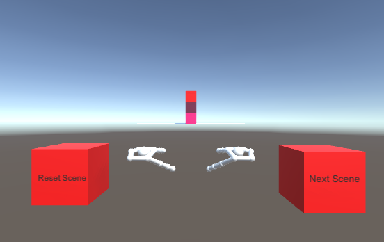
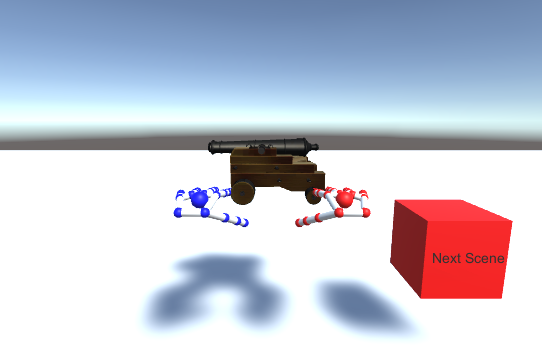

---
title: "Práctica 2 - Gestos"
author: "Javier Sáez, José María Borrás, Ismael Sánchez"
header-includes:
  -  \usepackage[utf8]{inputenc}
  -  \usepackage[T1]{fontenc}
  -  \usepackage[sfdefault,scaled=.85, lining]{FiraSans}
  -  \usepackage{geometry}
  -  \geometry{left=3cm,right=3cm,top=3cm,bottom=3cm,headheight=1cm,headsep=0.5cm}

output:
    pdf_document
---


# Introducción

En este documento se describirá la aplicación de interacción por gestos que se ha desarrollado que tiene relación con la visita a la Alhambra.

La aplicación tratará de , mediante el uso de diferentes gestos y el dispositivo **Leap Motion**, dar al usuario una visión simplificada de cómo era una posible arma de combate de la época. El entorno de desarrollo utilizado es **Unity**.

# Descripción General

En nuestra aplicación de Unity encontramos dos escenas principales:

- Escena de **prueba de disparo** del arma.
- Escena de **visualización** del arma: cañón.


Como hemos mencionado, el dispositivo para la captura de la interacción gestual es Leap Motion. Además, este debe utilizarse en su versión *Desktop*, es decir, apoyado sobre una mesa y el detector apuntando hacia arriba.

Ambas escenas estarán conectadas, pudiendo pasar de una a otra mediante una interacción con nuestro programa. Vamos ahora a describirlas de forma individual.

# Descripción técnica común

Comentamos primero la parte técnica que es común a las dos escenas.

Contaremos con una *Main Camera*, que estará situada detrás del controlador de nuestras manos, para que podamos tener una percepción de que son nuestras manos reales, viéndolas algo por debajo de nuestro campo visual.

En cada escena, tendremos un *LeapHandController* que controlará nuestras manos. Este es importado del *SDK* que podemos encontrar en la página oficial de *Leap*. Sin embargo, no es el controlador del paquete *Core*, sino el que podemos encontrar en el paquete de Interacción, pues podemos añadirlo a cada escena por separado.

También, en cada escena tendremos un *HandModel*, constituido por:

- *Capsule Hand Left*
- *Capsule Hand Right*

El *HandModel* tendrá un script interno *Hand Model Manager*, que permitirá que el dispositivo detecte nuestras manos.

Cada escena contendrá un objeto *Interaction Engine*, que nos permitirá que nuestros *GameObject* (objetos en la escena) puedan interactuar entre ellos. Este *Interaction Engine* contendrá como elementos principales las dos manos interactivas (*Interaction Hand Left/Right*). Toda la parte de interacción se encuentra en el módulo de *Interacción* mencionado anteriormente.

Además, cada objeto que haya en las escenas tendrá un script asociado llamado *Interaction Behaviour*, que nos permite que cada objeto que lo posea pueda ser parte de algún tipo de interacción. Por ejemplo, los cubos podrán detectar cuándo son tocados por primera vez y esto nos será útil para interactuar con la escena.

Para realizar las acciones en nuestro proyecto, se han escrito los siguientes scripts en ```C#```:

- *ResetScene*, que ayuda a resetear una de las escenas
- *SphereGenerator*, que ayuda a crear bolas y lanzarlas y genera uno de nuestros gestos implementados
- *ZoomBehaviour*, que ayuda a hacer zoom y hace el segundo gesto implementado
- *SceneM*, que ayuda a cambiar entre escenas


# Escena de prueba de disparo

En esta escena, encontraremos la siguiente disposición:



Podemos ver que tenemos dos cubos a los lados de nuestras manos virtuales:

- El cubo de la derecha, que nos llevará a la siguiente escena si lo tocamos
- El cubo de la izquierda, que reseteará la escena actual.

Al fondo, podemos observar 3 cubos apilados, que nos servirán para probar la interacción gestual de esta escena, que consistirá en lo siguiente:

- Usaremos la mano izquierda para apuntar en una dirección.
- Usaremos la mano derecha para accionar el cañón, de modo que, cuando cerremos el puño derecho, se disparará una bola

La bola lanzada podrá colisionar y modificar el estado de los cubos.

## Descripción técnica de la escena

### Cubo izquierdo (Reset Cube)

Es un *GameObject-Cube* de *Unity*. Posee, como ya hemos mencionado, un script *Interaction Behaviour* asociado a él que nos permite añadir desde Unity cierto tipo de interacciones.

En concreto, tiene añadido un evento *OnContactBegin* que hará que cuando se inicie el contacto con este objeto se lance una función de otro script asociado. Este script asociado se llama *ResetScene* y posee la función a la que se llama cuando se inicia el contacto. El código de la función lo que hace es recargar la escena mediante una sencilla orden:
```
SceneManager.LoadScene("SampleScene",LoadSceneMode.Single);
```
Con esto, haremos que la escena se resetee y los cubos vuelvan a estar apilados, de forma que podamos volver a golpearlos con las bolas del cañón.

### Cubo derecho (Next Scene)

También es un *GameObject-Cube*. Es igual que el anterior, con la salvedad de que la acción que se realiza en el contacto es diferente.

En concreto, cuando se detecta *OnContactBegin*, se llama a la función ```next_scene``` del script *SceneM*. En este script se declaran las escenas cuando se inicia el programa y lo que hará es pasar las escenas avanzando en un vector de izquierda a derecha. Está hecho así por si se quisieran añadir más escenas, se podría usar el mismo script simplemente añadiendo al vector de escenas las escenas necesarias.

La función ```next_scene```, sumará uno a al entero que maneja el índice con la escena activa (y hará el módulo $n$, donde $n$ es el número total de escenas), y cargará la escena que toque usando la misma función que utiliza nuestro cubo anterior.

### Interaction Hand Left/Right

Comentaremos las manos de forma conjunta. Estas son importadas del módulo de *Interacción* de *Leap*, y necesitamos que sea así para que nuestro *Interaction Manager* detecte las colisiones de las mismas con los cubos de la imagen. Además,también tendrán un script *Interaction Behaviour*  asociado a ellas, para poder detectar el gesto de cerrar el puño (en la mano derecha), que nos ayudará a disparar.

La mano derecha tendrá añadido un script llamado *Extended Finger Detector*, que nos permitirá definir el gesto de puño cerrado. Se definirá que cuando todos los dedos estén no extendidos, este script llamará a la función ```throwBall``` del script *SphereGenerator* que ya hemos mencionado. Esta función hará lo siguiente:

- Se comprueba que ambas manos estén siendo detectadas por el controlador de *Leap* en ese *frame* (escena en un instante de tiempo) concreto.
- Si ambas lo están , se crea una bola en la escena
- Se busca el vector que forma la mano *izquierda* desde la palma hacia sus dedos, llamémosle $v$.
- Se aplica a la bola una fuerza que tiene como vector: $2000*v$, donde el número escogido nos permite que la bola salga disparada a una velocidad adecuada para el uso en nuestro programa.

En resumen, cuando cerremos la mano derecha, se disparará una bola en la dirección hacia donde está apuntando la mano izquierda.

### Cubos apilados

Estos cubos estarán encima de un **plano** de *Unity*, y servirán para poder dispararles con nuestro gesto y tratar de derribarlos. Al resetear la escena, lo que se pretende es que los cubos estén de nuevo en su posición original.

# Escena de visualización del arma

En esta escena, encontraremos la siguiente disposición:



Podemos ver que tenemos un cubo al lado derecho de nuestras manos virtuales y un cañón enfrente. Se podrá interactuar con este cañón.

## Descripción técnica de la escena

En esta escena tendremos un gesto de manos que nos acercará y alejará del cañón que se nos muestra, de forma que podremos observarlo más de cerca, y podremos tocarlo con nuestras manos y girarlo para ver cada una de sus partes. Podremos incluso rotar de forma independiente el soporte del cañón y la parte que realiza el disparo.

### Cubo (next scene)

Este cubo será exactamente el mismo que tenemos en la escena anterior. Llamará a la misma función que nos permitirá cambiar de escena.

### Cañón

Este es un objeto descargado de los *assets* disponibles en la página oficial de *Unity*. Nos proporciona un *GameObject* compuesto de varias piezas 3D que hacen la figura de un cañón a la antigua. A este cañón, le añadimos el script *InteractionBehaviour* y un *collider*, que nos permite que podamos interactuar tocándolo con nuestras manos virtuales.

Además, fijamos su posición en el plano, para que al tocarlo no se vaya por la gravedad flotando por el espacio y perdamos el control sobre él. Dejamos la rotación sin fijar para poder girarlo y observarlo a nuestro antojo.

### Interaction Hand Left/Right

De nuevo tenemos nuestras manos en la escena. En este caso, ambas manos tendrán el script *Extended Finger Detector*, pues para iniciar el gesto de *Zoom* requeriremos que ambas manos estén cerradas completamente. El script que se encargará de todo será *ZoomBehaviour*. Este tendrá varias variables que irán controlando nuestro gesto.

- *closedLeft/closedRight*, que nos indicarán si las manos están cerradas. Nos servirán para comprobar que ambas están cerradas y poder iniciar el zoom. Cuando la mano izquierda(derecha) se cierre, llamará a una función del script llamada ```closedL``` (```closedR```), que cambiará el valor de estos booleanos y luego llamará a la funcion ```zoom```
- ```float start_zoom_time```, cuando se llame a la función ```zoom``` y ambas manos estén cerradas, tomará el instante de tiempo en el que esto ocurre. Además, cuando ocurra también se guardará el *frame* actual,```start_zoom_frame```, para comprobar luego la posición de las manos con respecto a este *frame*. Además, este frame se pondrá en *null* si alguna de las manos se abre, lo cual se comprobará mediante un par de funciones que también ponen los booleanos anteriores en *false*.
- *isZoomed* es una variable que nos servirá para detectar si en el estado actual de la escena ya hemos hecho zoom o no. Esto nos servirá para no hacer zoom si la cámara ya se ha acercado al objeto, o no alejarnos más del cañón si la cámara no está en zoom.
- Habrá variables privadas que nos servirán para hacer el zoom de la cámara.


Con estas variables, la función *Update* de nuestro script (que , en *Unity* se llama una vez cada vez que ocurre un *frame*), se encargará de hacer el zoom. El procedimiento será el siguiente:

1. Se comprueba que ambas manos estén cerradas, y que se haya guardado el *frame* donde se inicia el gesto.
2. Se toma el tiempo actual y se comprueba que haya pasado un número mínimo de tiempo (usando ```start_zoom_time```) desde que se detectó que las manos están cerradas, para que puedan moverse hacia los lados en ese tiempo
3. Si ese tiempo ha ocurrido, se toma la posición de las manos en el *frame* actual y la posición de las manos en el ```start_zoom_frame```. Entonces, se hace la diferencia entre las distancias entre las manos. Así, si la diferencia de distancias es mayor que cero, las manos se habrán separado más respecto al *frame* inicial y estaremos haciendo un *zoom*. En el caso contrario, las manos se habrán acercado y estaremos intentando alejarnos (si hemos hecho previamente el zoom).
4. Así, si la distancia es positiva, se comprobará primero que es mayor que un umbral de distancia, para que el gesto sea suficientemente significativo. Si es mayor que el umbral, y no se ha hecho zoom aún (```isZoomed == false```) lo es se hará una modificación en el estado de la cámara para que se acerque en la dirección en la que está mirando en ese momento. Además, se hará ```isZoomed = true``` para indicar que se ha hecho zoom y no se pueda hacer otro zoom hasta que se deshaga el anterior.
5. Si la distancia es negativa, también se comprobará que sea menor que un umbral y que el zoom esté hecho, y si esto ocurre se devolverá a la cámara a su estado inicial.


# En resumen

Hemos creado dos escenas y hemos implementado dos gestos que son propios:

- Gesto de apuntar y disparar
- Gesto de zoom con dos manos

Además hemos utilizado varios gestos que venían implementados en el *SDK* de *Leap*, como:

- Movimiento de las manos
- Detección de toques entre objetos
- Detección de extensión de los dedos
